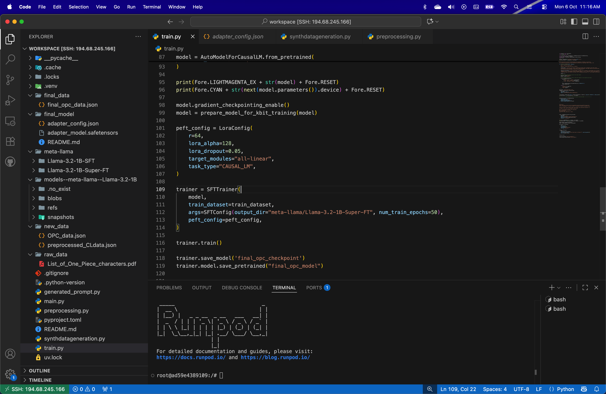

# askmyprofession
AskMyProfession allows users to access "niche" Domain Experts (eg.: Operations Research Scientist (ORS)) which are fine-tuned for your niche work! 

Base Model: Meta's Llama 3.2 1B Instruct

Custom Model Hosted on __Hugging Face__ : https://huggingface.co/karnavivek/Constraint_Learning_LLM/tree/main

Model Card for Model ID
This modelcard aims to be a base template for new models. It has been generated using this raw template.

Model Details
Model Description
This Model is trained on Constraint Learning Concepts (D. Maragno et. al. (2021)). This Concept Helps users to get insights about Integration of Machine learning models into optimization models. This is model is trained on Runpod RTX A5000 with 4-bit Quantization.

Better Version of this model will be released soon.

Developed by: Vivek Karna
Funded by: NA
Original Concept by [optional]: Donato Maragno
Model type: Text Generation
Finetuned from model: meta-Llama-3.2-1B
Repository: https://github.com/karnavivek/askmyprofession.git
Paper: Mixed Integer Optimization with Constraint Learning

__More Details Will be Added Soon__
